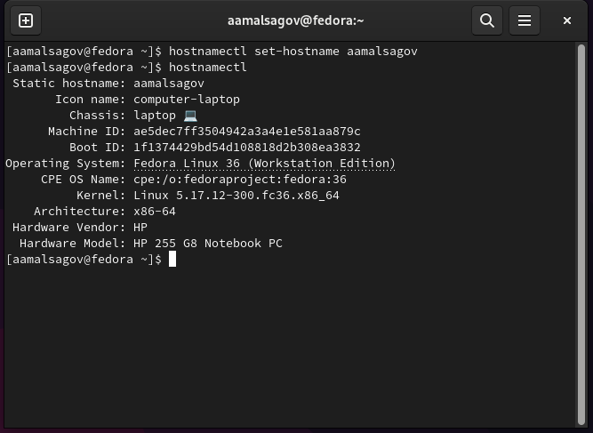
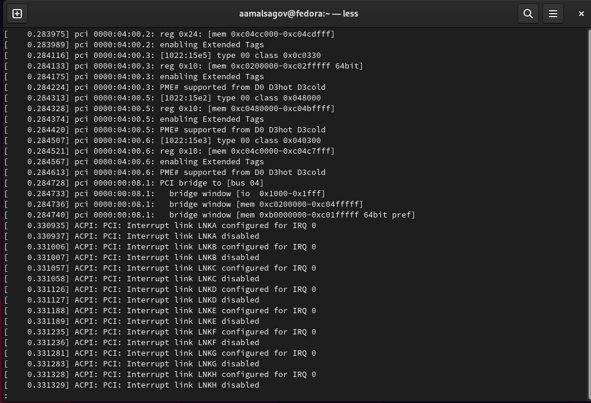
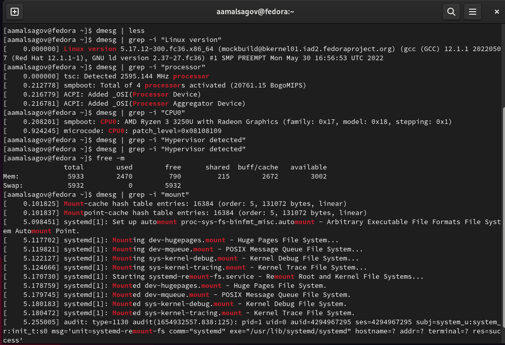

---
## Front matter
lang: ru-RU
title: "Установка и конфигурация операционной системы на виртуальную машину"
author: Мальсагов А.А.
institute:
date: 

## Formatting
toc: false
slide_level: 2
theme: metropolis
header-includes: 
 - \metroset{progressbar=frametitle,sectionpage=progressbar,numbering=fraction}
 - '\makeatletter'
 - '\beamer@ignorenonframefalse'
 - '\makeatother'
aspectratio: 43
section-titles: true
---

## Цель работы

Приобретение практических навыков установки операционной системы на виртуальную машину, настройки минимально необходимых для дальнейшей работы сервисов. 

---

## Выполнение лабораторной работы

При установке виртуальной машины у меня возникли некоторые проблемы, которые я не смог решить. Поэтому я установил вторую операционную систему Fedora рядом с windows, указал имя пользователя и пароль при первом запуске без записи. Далее я указал имя хоста.(рис. [-@fig:001])

{ #fig:001 width=70% }

---

## Выполнение лабораторной работы

Домашнее задание:

1. В окне терминала проанализируйте последовательность загрузки системы.(рис. [-@fig:002])

{ #fig:002 width=70% }

---

## Выполнение лабораторной работы

2. Получите следующую информацию.
    1. Версия ядра Linux (Linux version).
    2. Частота процессора (Detected Mhz processor).
    3. Модель процессора (CPU0).
    4. Объем доступной оперативной памяти (Memory available).
    5. Тип обнаруженного гипервизора (Hypervisor detected).
    6. Тип файловой системы корневого раздела.
    7. Последовательность монтирования файловых систем.

---

## Выполнение лабораторной работы

(рис. [-@fig:003])

{ #fig:003 width=70% }

---

## Выводы

Мы научились устанавливать вторую операционную систему.
