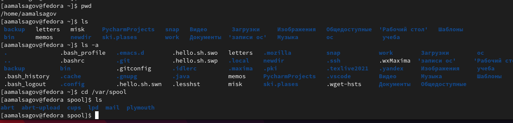
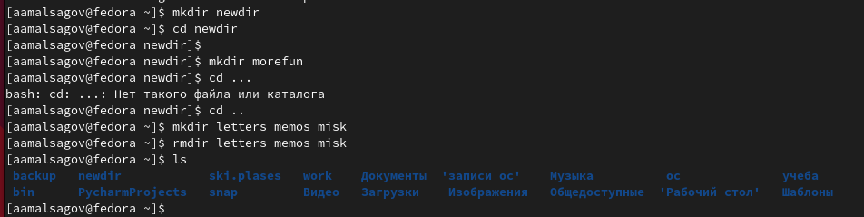
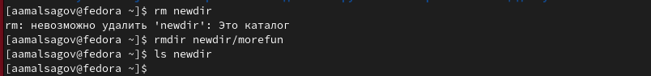
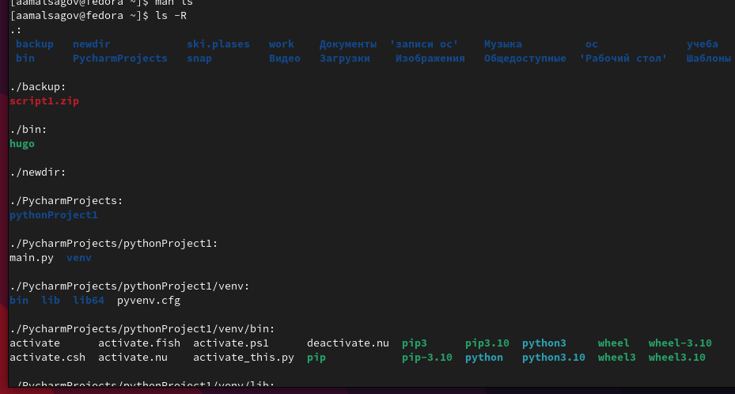
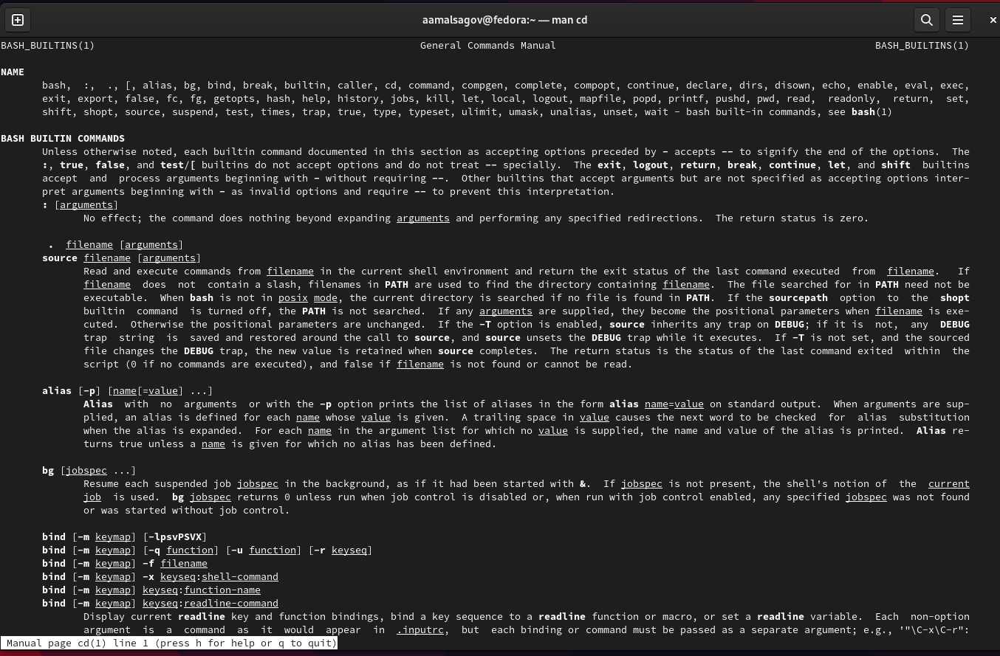
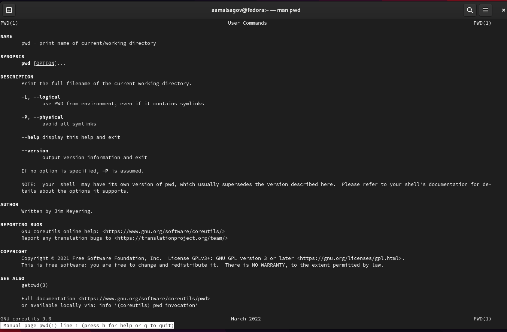
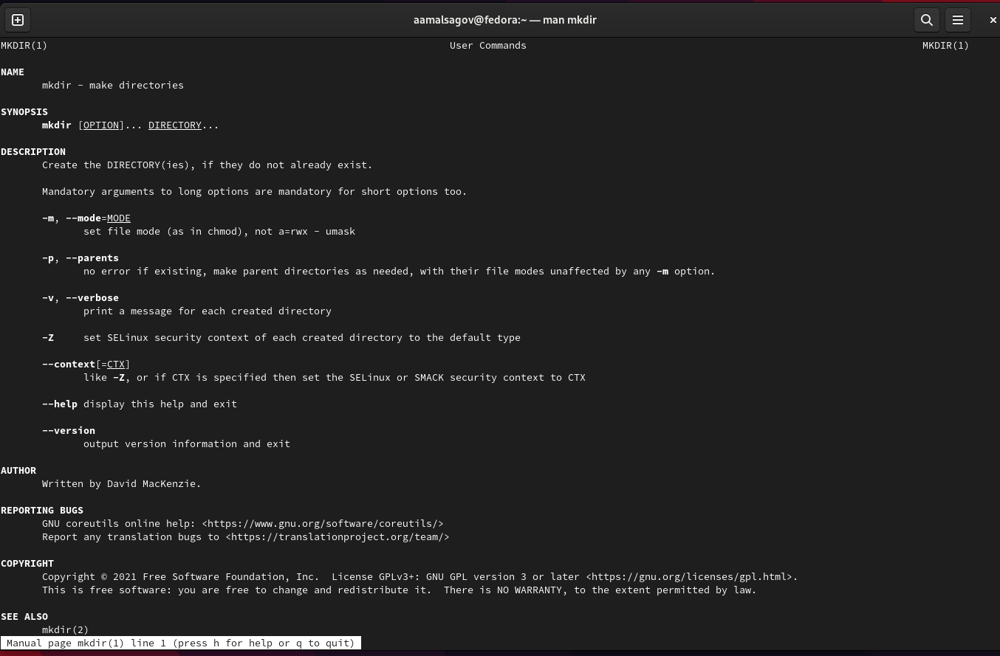
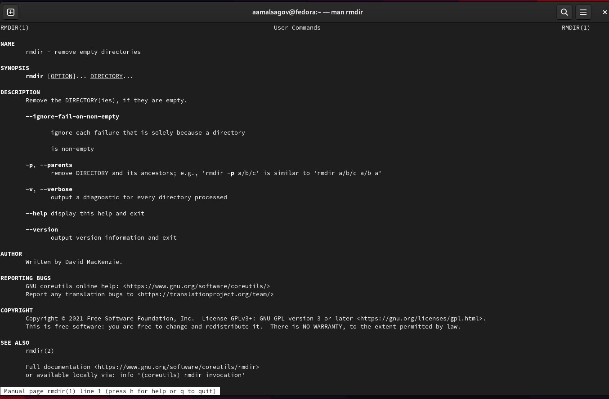
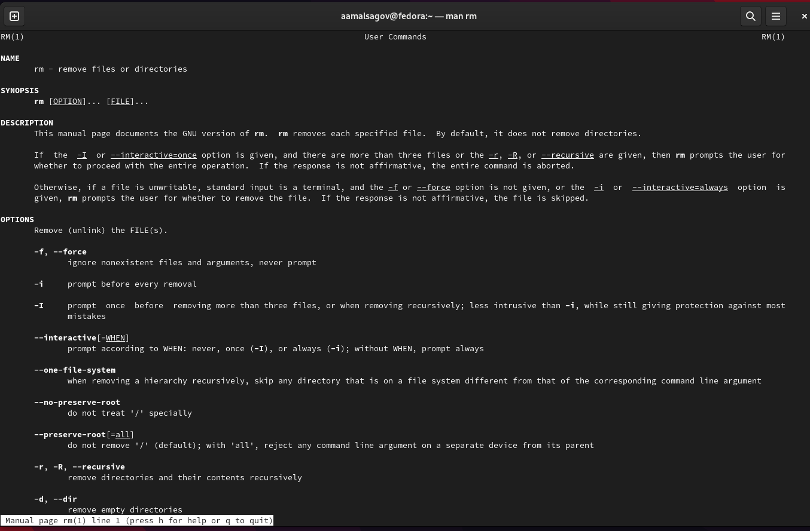
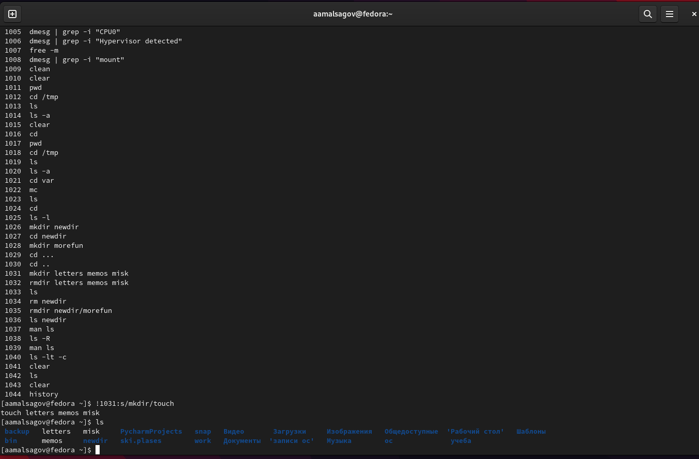

---
## Front matter
lang: ru-RU
title: "Основы интерфейса взаимодействия пользователя с системой Unix на уровне командной строки"
author: Мальсагов А.А.
institute:
date: 

## Formatting
toc: false
slide_level: 2
theme: metropolis
header-includes: 
 - \metroset{progressbar=frametitle,sectionpage=progressbar,numbering=fraction}
 - '\makeatletter'
 - '\beamer@ignorenonframefalse'
 - '\makeatother'
aspectratio: 43
section-titles: true
---

## Цель работы

Приобретение практических навыков взаимодействия пользователя с системой посред-
ством командной строки.

---

## Выполнение лабораторной работы

1. Определил полное имя вашего домашнего каталога.

2. Выполнил следующие действия:
    1. Перешел в каталог /tmp.
    2. Вывел на экран содержимое каталога /tmp. Для этого использовал команду ls
    с различными опциями.
    3. Определил, есть ли в каталоге /var/spool подкаталог с именем cron.
    4. Перешел в домашний каталог и вывел на экран его содержимое. Опре-
    делил, кто является владельцем файлов и подкаталогов.(рис. [-@fig:001])

---

## Выполнение лабораторной работы

{ #fig:001 width=70% }

3. Выполните следующие действия:
    1. В домашнем каталоге создайте новый каталог с именем newdir.
    2. В каталоге ~/newdir создайте новый каталог с именем morefun.
    3. В домашнем каталоге создайте одной командой три новых каталога с именами
    letters, memos, misk. Затем удалите эти каталоги одной командой.
    4. Попробуйте удалить ранее созданный каталог ~/newdir командой rm. Проверьте,
    был ли каталог удалён.
    5. Удалите каталог ~/newdir/morefun из домашнего каталога. Проверьте, был ли
каталог удалён.(рис. [-@fig:002;-@fig:003])

---

## Выполнение лабораторной работы

{ #fig:002 width=70% }

---

## Выполнение лабораторной работы

{ #fig:003 width=70% }

---

## Выполнение лабораторной работы

4. С помощью команды man ls вывел справку по команде **ls**. В ней я нашел опцию -R, которая позволяет просмотреть содержимое выводимых каталогов.(рис. [-@fig:004])

{ #fig:004 width=70% }

---

## Выполнение лабораторной работы

5. Используя команду *man* для просмотра описания следующих команд: *cd*, *pwd*, *mkdir*, *rmdir*, *rm*. На скринкасте поянил основные опции данных команд.(рис. [-@fig:005])

{ #fig:005 width=70% }

---

## Выполнение лабораторной работы

- -P - позволяет следовать по символическим ссылкам перед тем, как будут обработаны все переходы "..";
- -L - переходит по символическим ссылкам только после того, как были обработаны "..";
- -e - если папку, в которую нужно перейти не удалось найти - выдает ошибку
(рис. [-@fig:006])

{ #fig:006 width=70% }

---

## Выполнение лабораторной работы

- -L, --logical - брать директорию из переменной окружения, даже если она содержит символические ссылки;
- -P - отбрасывать все символические ссылки;
- --help - отобразить справку по утилите;
- --version - отобразить версию утилиты.
(рис. [-@fig:007])

---

## Выполнение лабораторной работы

{ #fig:007 width=70% }

---

## Выполнение лабораторной работы

- -m (--mode=режим) - назначить режим доступа (права). По умолчанию mod принимает значение 0777, что обеспечивает неограниченные права.
- -p (--parents) - не показывать ошибки, а также их игнорировать.
- -z  (--context=CTX ) принимает контекст SELinux для каталога по умолчанию.
- -v (--verbose) - выводить сообщение о каждом новым каталоге.
- --help - вывести справочную информацию.
- --version - выводит информацию о текущей версии утилиты.
(рис. [-@fig:008])

---

## Выполнение лабораторной работы

{ #fig:008 width=70% }

---

## Выполнение лабораторной работы

- --ignore-fail-on-non-empty
> игнорирование наличие файлов в каталоге.
- -p, --parents
> Позволяет удалить каталог и вышележащие каталоги, оказавшиеся пустыми.
- -v, --verbose
> вывод выполнения всех действий.
- --help
> вывод инструкции.
- --version
> вывод информации о версии.
(рис. [-@fig:009])

---

## Выполнение лабораторной работы

{ #fig:009 width=70% }

---

## Выполнение лабораторной работы

- -f или --force
> Игнорировать несуществующие файлы и аргументы. Никогда не выдавать запросы на подтверждение удаления.

- -i
> Выводить запрос на подтверждение удаления каждого файла.

- -I
> Выдать один запрос на подтверждение удаления всех файлов, если удаляется больше трех файлов или используется рекурсивное удаление. Опция применяется, как более «щадящая» версия опции -i

- --one-file-system
> Во время рекурсивного удаления пропускать директории, которые находятся на других файловых системах.

---

## Выполнение лабораторной работы

- -r или -R или --recursive
> Удаление директорий и их содержимого. Рекурсивное удаление.

6. С помощью команды **history** вывел все ранее введеннные команды, модифицировал одну из них.(рис. [-@fig:010])

{ #fig:010 width=70% }

## Выводы

Мы получили практические навыки взаимодействия пользователя с системой Unix на уровне командной строки.
