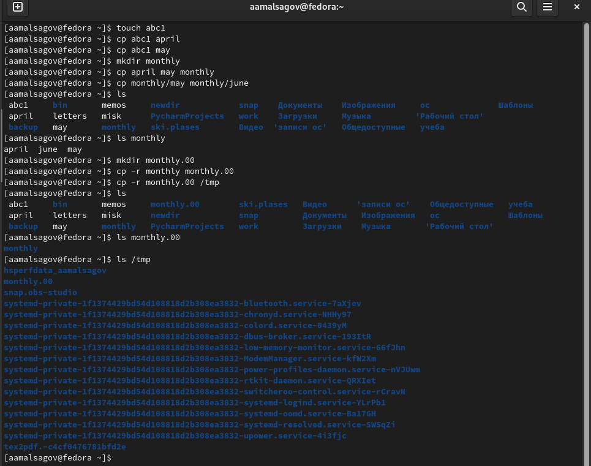
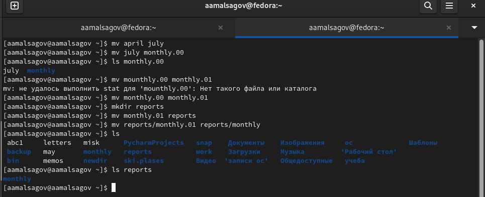
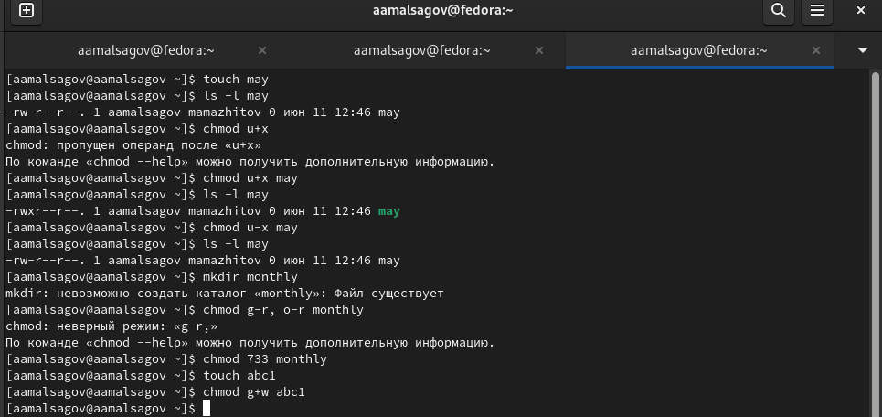
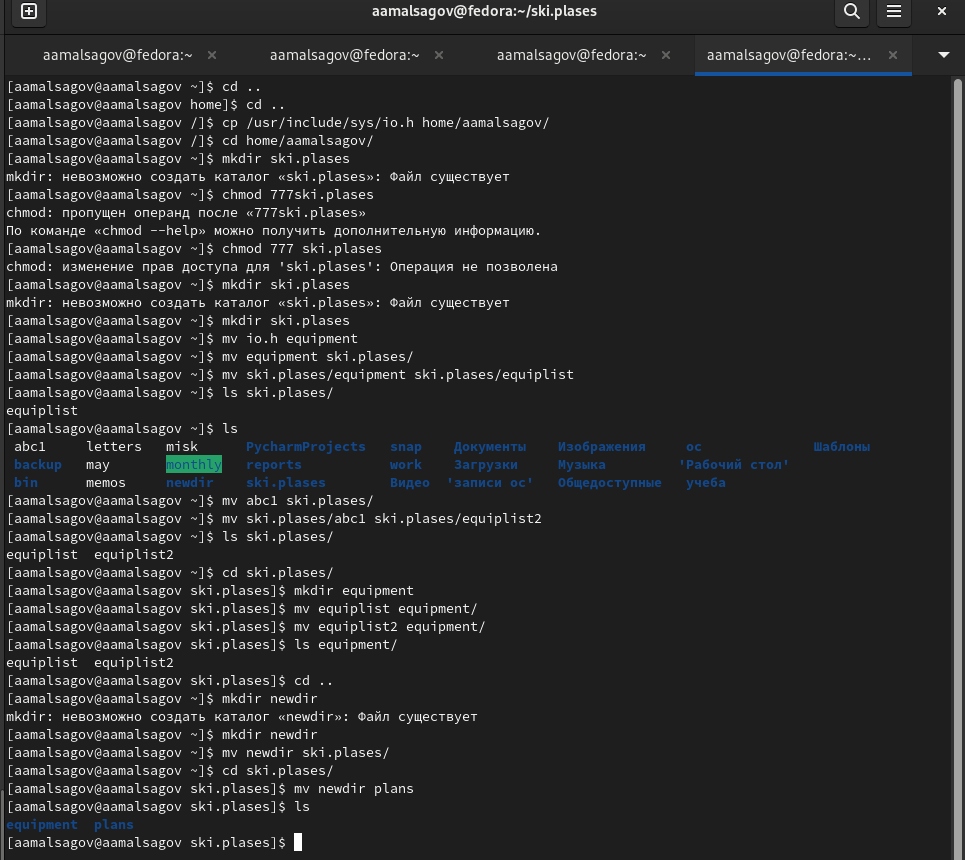
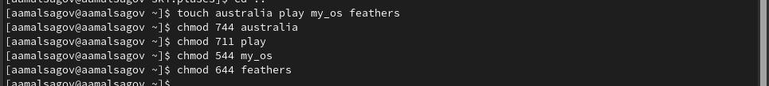
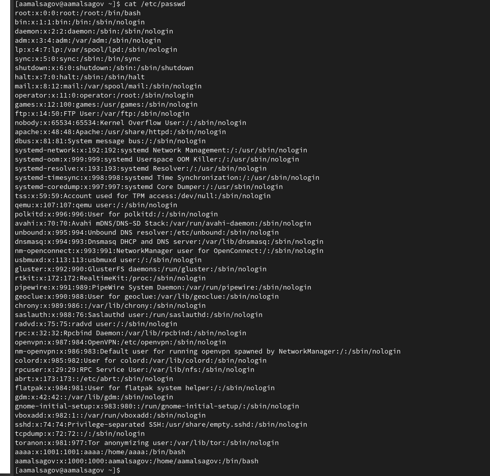
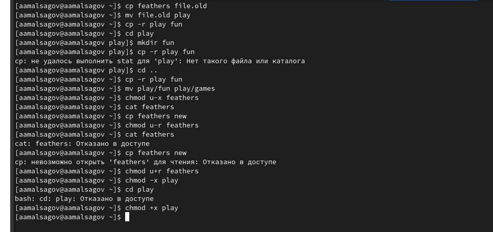

---
## Front matter
lang: ru-RU
title: "Анализ файловой системы Linux. Команды для работы с файлами и каталогами"
author: Мальсагов А.А.
institute:
date: 

## Formatting
toc: false
slide_level: 2
theme: metropolis
header-includes: 
 - \metroset{progressbar=frametitle,sectionpage=progressbar,numbering=fraction}
 - '\makeatletter'
 - '\beamer@ignorenonframefalse'
 - '\makeatother'
aspectratio: 43
section-titles: true
---

## Цель работы

Ознакомление с файловой системой Linux, её структурой, именами и содержанием каталогов. Приобретение практических навыков по применению команд для работы с файлами и каталогами, по управлению процессами (и работами), по проверке использования диска и обслуживанию файловой системы.

---

## Выполнение лабораторной работы

1. Выполнил все примеры. (рис. [-@fig:001;-@fig:002;-@fig:003])

{ #fig:001 width=70% }

---

## Выполнение лабораторной работы

{ #fig:002 width=70% }

---

## Выполнение лабораторной работы

{ #fig:003 width=70% }

---

## Выполнение лабораторной работы

2. Выполнил следующие действия, зафиксировав в отчёте по лабораторной работе используемые при этом команды и результаты их выполнения:
    1. Скопировал файл /usr/include/sys/io.h в домашний каталог и назвал его equipment.
    2. В домашнем каталоге создал директорию ~/ski.plases.
    3. Переместил файл equipment в каталог ~/ski.plases.
    4. Переименовал файл ~/ski.plases/equipment в ~/ski.plases/equiplist.
    5. Создал в домашнем каталоге файл abc1 и скопировал его в каталог ~/ski.plases, назвал его equiplist2.
    6. Создал каталог с именем equipment в каталоге ~/ski.plases.
    7. Переместил файлы ~/ski.plases/equiplist и equiplist2 в каталог ~/ski.plases/equipment.
    8. Создал и переместил каталог ~/newdir в каталог ~/ski.plases и назвал его plans. (рис. [-@fig:004])

---

## Выполнение лабораторной работы

{ #fig:004 width=70% }

---

## Выполнение лабораторной работы

3. Создал файлы **australia**, **play**, **my_os**, **feathers** и изменил их права лоступа.(рис. [-@fig:005])

{ #fig:005 width=70% }

---

## Выполнение лабораторной работы

4. Проделал приведённые ниже упражнения:
    1. Просмотрел содержимое файла /etc/password.
    2. Скопировал файл ~/feathers в файл ~/file.old.
    3. Переместил файл ~/file.old в каталог ~/play.
    4. Скопировал каталог ~/play в каталог ~/fun.
    5. Переместил каталог ~/fun в каталог ~/play и назвал его games.
    6. Лишил владельца файла ~/feathers права на чтение.
    7. Попробовал прочитать файл feathers, но терминал выдал ошибку.
    8. Попытался скопировать тот же файл, но снова ошибка.
    9. Дал владельцу файла ~/feathers право на чтение.
    10. Лишил владельца каталога ~/play права на выполнение.
    11. Попробовал перейти в каталог play, но терминал выдал ошибку.
    12. Вернул владельцу каталога ~/play право на выполнение.(рис. [-@fig:006;-@fig:007])

{ #fig:006 width=70% }

---

## Выполнение лабораторной работы

{ #fig:007 width=70% }

---

## Выводы

Мы получили практические навыки взаимодействия пользователя с системой Unix на уровне командной строки.
