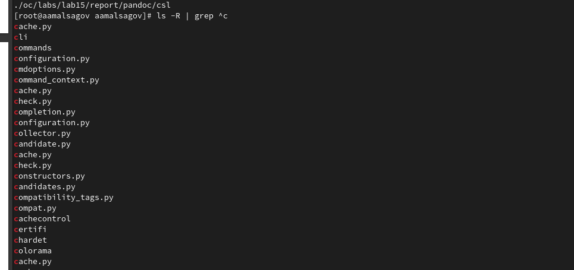

---
## Front matter
lang: ru-RU
title: "Поиск файлов. Перенаправлениеввода-вывода. Просмотр запущенных процессов"
author: Мальсагов А.А.
institute:
date: 

## Formatting
toc: false
slide_level: 2
theme: metropolis
header-includes: 
 - \metroset{progressbar=frametitle,sectionpage=progressbar,numbering=fraction}
 - '\makeatletter'
 - '\beamer@ignorenonframefalse'
 - '\makeatother'
aspectratio: 43
section-titles: true
---

## Цель работы

Ознакомление с инструментами поиска файлов и фильтрации текстовых данных. Приобретение практических навыков: по управлению процессами (и заданиями), по проверке использования диска и обслуживанию файловых систем.

---

## Выполнение лабораторной работы

1. Записал в файл file.txt названия файлов, содержащихся в каталоге /etc. Дописал в этот же файл названия файлов, содержащихся в домашнем каталоге. Вывел имена всех файлов из file.txt, имеющих расширение .conf.(рис. [-@fig:001])

{ #fig:001 width=70% }

---

## Выполнение лабораторной работы

2. Записал название эти файлов в conf.txt, вывел название всех файлов в домашнем каталоге, имена которых начинаются с **c** с помощью **find**. (рис. [-@fig:002])

{ #fig:002 width=70% }

---

## Выполнение лабораторной работы

3. Сделал то же самое с помощью **ls**, конвейера и grep.(рис. [-@fig:003])

{ #fig:003 width=70% }

---

## Выполнение лабораторной работы

4. Вывел на экран (по странично) имена файлов из каталога /etc, начинающиеся с символа h. Запустил в фоновом режиме процесс, который будет записывать в файл ~/logfile файлы, имена которых начинаются с log.(рис. [-@fig:004])

{ #fig:004 width=70% }

---

## Выполнение лабораторной работы

5. Запустил из консоли в фоновом режиме редактор gedit.(рис. [-@fig:005])

{ #fig:005 width=70% }

---

## Выполнение лабораторной работы

6. Определил идентификатор процесса gedit, используя команду ps, конвейер и фильтр grep, после чего, используя kill, завершил процесс gedit.(рис. [-@fig:006])

{ #fig:006 width=70% }

---

## Выполнение лабораторной работы

7. Воспльзовался командами **df** и **du**.(рис. [-@fig:007;-@fig:008])

{ #fig:007 width=70% }

---

## Выполнение лабораторной работы

{ #fig:008 width=70% }

---

## Выводы

Мы научились пользоваться инструментами поиска файлов и филтрации текстовых данных. Приобретели практические навыки: по управлению процессами (и заданиями), по проверке использования диска и обслуживанию файловых систем.