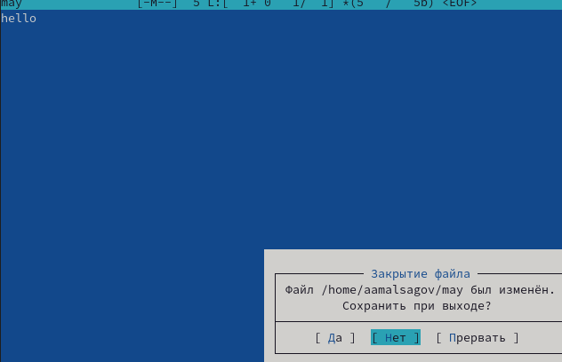

---
## Front matter
lang: ru-RU
title: "Командная оболочка Midnight Commander"
author: Мальсагов А.А.
institute:
date: 

## Formatting
toc: false
slide_level: 2
theme: metropolis
header-includes: 
 - \metroset{progressbar=frametitle,sectionpage=progressbar,numbering=fraction}
 - '\makeatletter'
 - '\beamer@ignorenonframefalse'
 - '\makeatother'
aspectratio: 43
section-titles: true
---

## Цель работы

Освоение основных возможностей командной оболочки Midnight Commander. Приобретение навыков практической работы по просмотру каталогов и файлов; манипуляций с ними.

---

## Выполнение лабораторной работы

1. Запустил из командной строки mc, изучил его структуру и меню. Выполнил несколько операций, таких как копирование, перемещение, создание нового каталога(рис. [-@fig:001;-@fig:002;-@fig:003])

{ #fig:001 width=70% }

---

## Выполнение лабораторной работы

{ #fig:002 width=70% }

---

## Выполнение лабораторной работы

{ #fig:003 width=70% }

---

## Выполнение лабораторной работы

2. Выполнил основные команды меню левой панели. (рис. [-@fig:004;-@fig:005;-@fig:006])

{ #fig:004 width=70% }

---

## Выполнение лабораторной работы

{ #fig:005 width=70% }

---

## Выполнение лабораторной работы

{ #fig:006 width=70% }

---

## Выполнение лабораторной работы

3. Используя возможности подменю **Файл**, выполнил:
- просмотр содержимого текстового файла;
- редактирование содержимого текстового файла (без сохранения результатов редактирования);
- создание каталога;
- копирование в файлов в созданный каталог.(рис. [-@fig:007;-@fig:008;-@fig:009;-@fig:010])

{ #fig:007 width=70% }

---

## Выполнение лабораторной работы

{ #fig:008 width=70% }

---

## Выполнение лабораторной работы

{ #fig:009 width=70% }

---

## Выполнение лабораторной работы

{ #fig:010 width=70% }

---

## Выполнение лабораторной работы

4. С помощью соответствующих средств подменю **Команда** осуществил:
- поиск в файловой системе файла с заданными условиями;
- выбор и повторение одной из предыдущих команд;
- переход в домашний каталог;
- анализ файла меню и файла расширений.(рис. [-@fig:011;-@fig:012;-@fig:013;-@fig:014])

{ #fig:011 width=70% }

---

## Выполнение лабораторной работы

{ #fig:012 width=70% }

---

## Выполнение лабораторной работы

{ #fig:013 width=70% }

---

## Выполнение лабораторной работы

{ #fig:014 width=70% }

---

## Выполнение лабораторной работы

5. Вызвыл подменю **Настройки**. Освоил операции, определяющие структуру экрана mc.(рис. [-@fig:015;-@fig:016])

{ #fig:015 width=70% }

---

## Выполнение лабораторной работы

{ #fig:016 width=70% }

---

## Выполнение лабораторной работы

6. Создал файл text.txt, открыл его с помощью встроенного редактор mc и вставил туда текст.(рис. [-@fig:017])

{ #fig:017 width=70% }

---

## Выполнение лабораторной работы

7. Проделал с текстом следующие манипуляции, используя горячие клавиши:
    1. Удалил строку текста.
    2. Выделил фрагмент текста и скопировал его на новую строку.
    3. Выделил фрагмент текста и перенес его на новую строку.
    4. Сохранил файл.
    5. Отменил последнее действие.
    6. Перешел в конец файла (нажав комбинацию клавиш) и написал hello.
    7. Перешед в начало файла (нажав комбинацию клавиш) и написал hello.
    8. Сохранил и закрыл файл.рис. [-@fig:018;-@fig:019;-@fig:020;-@fig:021-@fig:022])

---

## Выполнение лабораторной работы

{ #fig:018 width=70% }

---

## Выполнение лабораторной работы

{ #fig:019 width=70% }

---

## Выполнение лабораторной работы

{ #fig:020 width=70% }

---

## Выполнение лабораторной работы

{ #fig:21 width=70% }

---

## Выполнение лабораторной работы

{ #fig:022 width=70% }

---

## Выполнение лабораторной работы

8. Используя меню редактора выключил подсветку синтаксиса.(рис. [-@fig:023])

{ #fig:023 width=70% }

---

## Выводы

Мы получили базовые навыки использование mc.