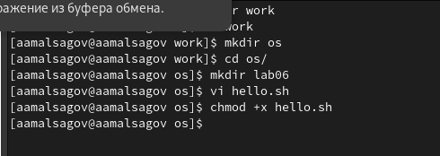
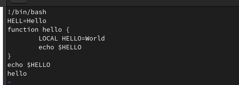
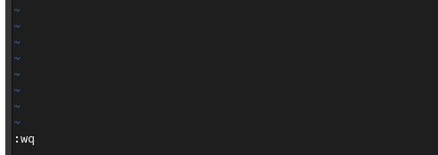
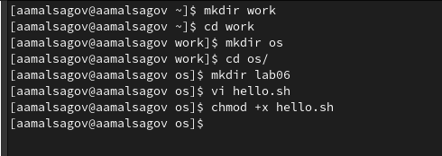
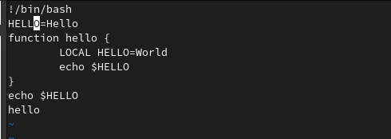
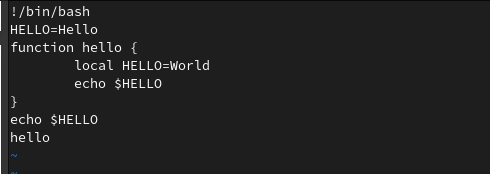
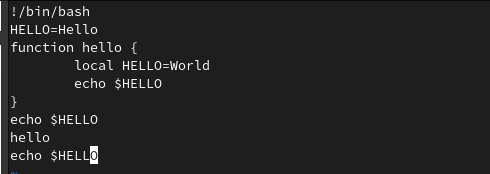
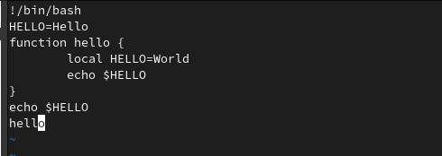
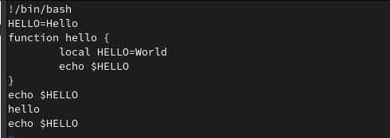

---
## Front matter
lang: ru-RU
title: "Текстовой редактор vi"
author: Мальсагов А.А.
institute:
date: 

## Formatting
toc: false
slide_level: 2
theme: metropolis
header-includes: 
 - \metroset{progressbar=frametitle,sectionpage=progressbar,numbering=fraction}
 - '\makeatletter'
 - '\beamer@ignorenonframefalse'
 - '\makeatother'
aspectratio: 43
section-titles: true
---

## Цель работы

Познакомиться с операционной системой Linux. Получить практические навыки работы с редактором vi, установленным по умолчанию практически во всех дистрибутивах.

---

## Выполнение лабораторной работы

1. Создал новый каталог **work/os/lab06**. С помощью vi создал файл hello.sh.(рис. [-@fig:001])

{ #fig:001 width=70% }

---

## Выполнение лабораторной работы

2. Перешел в режим вставки и ввел текст. (рис. [-@fig:002])

{ #fig:002 width=70% }

---

## Выполнение лабораторной работы

3. Сохранил изменениея.(рис. [-@fig:003])

{ #fig:003 width=70% }

---

## Выполнение лабораторной работы

4. Сделал файл исполняемым.(рис. [-@fig:004])

{ #fig:004 width=70% }

---

## Выполнение лабораторной работы

5. Заменил **HELL** на **HELLO**.(рис. [-@fig:005])

{ #fig:005 width=70% }

---

## Выполнение лабораторной работы

6. Заменил **LOCAL** на **local**. (рис. [-@fig:006])

{ #fig:006 width=70% }

---

## Выполнение лабораторной работы

7. Вставил в конец файла текст.(рис. [-@fig:007])

{ #fig:007 width=70% }

---

## Выполнение лабораторной работы

8. Удалил последнюю строку.(рис. [-@fig:008])

{ #fig:008 width=70% }

---

## Выполнение лабораторной работы

9. Отменил последнее действие.(рис. [-@fig:009])

{ #fig:009 width=70% }

---

## Выполнение лабораторной работы

10. Сохранил изменениея.(рис. [-@fig:010])

{ #fig:010 width=70% }

---

## Выводы

Мы получили базовые навыки использования vi.
