---
## Front matter
title: "Лабораторная работа №7"
subtitle: "Текстовой редактор emacs"
author: "Мальсагов Акрамат Абу-Бакарович"

## Generic otions
lang: ru-RU
toc-title: "Содержание"

## Bibliography
bibliography: bib/cite.bib
csl: pandoc/csl/gost-r-7-0-5-2008-numeric.csl

## Pdf output format
toc: true # Table of contents
toc-depth: 2
lof: true # List of figures
lot: true # List of tables
fontsize: 12pt
linestretch: 1.5
papersize: a4
documentclass: scrreprt
## I18n polyglossia
polyglossia-lang:
  name: russian
  options:
	- spelling=modern
	- babelshorthands=true
polyglossia-otherlangs:
  name: english
## I18n babel
babel-lang: russian
babel-otherlangs: english
## Fonts
mainfont: PT Serif
romanfont: PT Serif
sansfont: PT Sans
monofont: PT Mono
mainfontoptions: Ligatures=TeX
romanfontoptions: Ligatures=TeX
sansfontoptions: Ligatures=TeX,Scale=MatchLowercase
monofontoptions: Scale=MatchLowercase,Scale=0.9
## Biblatex
biblatex: true
biblio-style: "gost-numeric"
biblatexoptions:
  - parentracker=true
  - backend=biber
  - hyperref=auto
  - language=auto
  - autolang=other*
  - citestyle=gost-numeric
## Pandoc-crossref LaTeX customization
figureTitle: "Рис."
tableTitle: "Таблица"
listingTitle: "Листинг"
lofTitle: "Список иллюстраций"
lotTitle: "Список таблиц"
lolTitle: "Листинги"
## Misc options
indent: true
header-includes:
  - \usepackage{indentfirst}
  - \usepackage{float} # keep figures where there are in the text
  - \floatplacement{figure}{H} # keep figures where there are in the text
---

# Цель работы

Познакомиться с операционной системой Linux. Получить практические навыки работы с редактором Emacs.

# Выполнение лабораторной работы

1. Открыл emacs, создал lab07.sh и вставил текст.(рис. [-@fig:001])

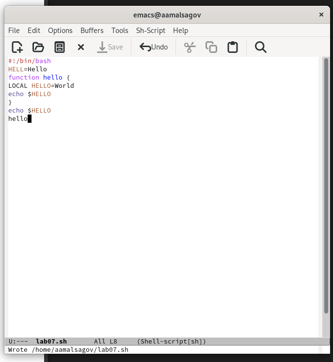{ #fig:001 width=70% }

2. Вырезал последнюю строку. (рис. [-@fig:002])

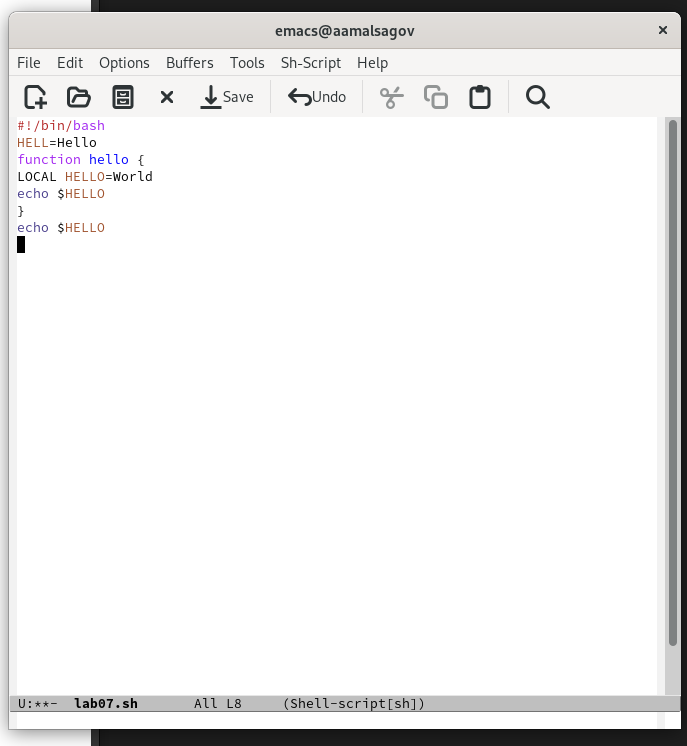{ #fig:002 width=70% }

3. Отменил последнее действие.(рис. [-@fig:003])

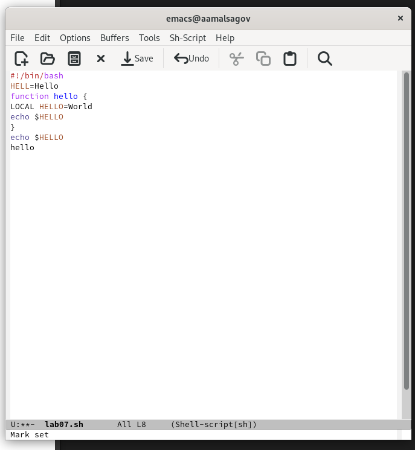{ #fig:003 width=70% }

4. Вырезал строку.(рис. [-@fig:004])

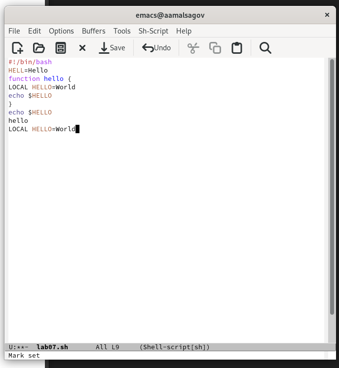{ #fig:004 width=70% }

5. Отменил последнее действие.(рис. [-@fig:005])

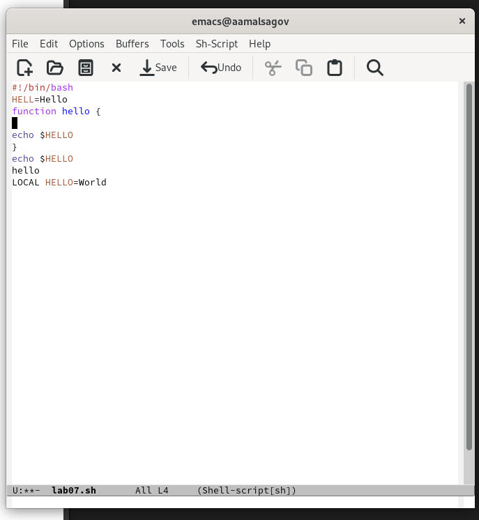{ #fig:005 width=70% }

6. Переместил курсор в начало строки. (рис. [-@fig:006])

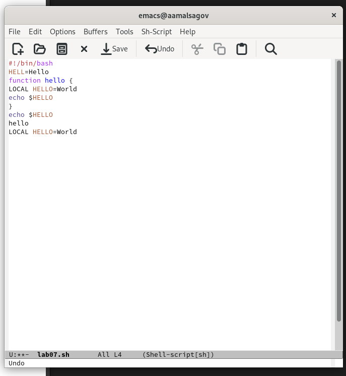{ #fig:006 width=70% }

7. Переместите курсор в конец строки.(рис. [-@fig:007])

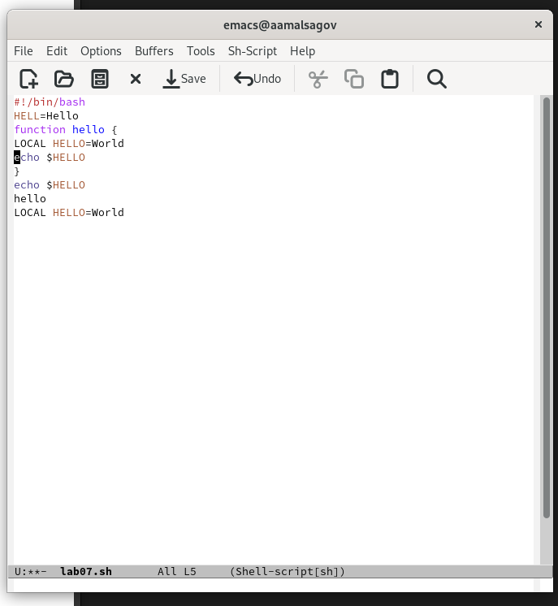{ #fig:007 width=70% }

8. Переместил курсор в начало буфера.(рис. [-@fig:008])

{ #fig:008 width=70% }

9. Переместил курсор в конец буфера.(рис. [-@fig:009])

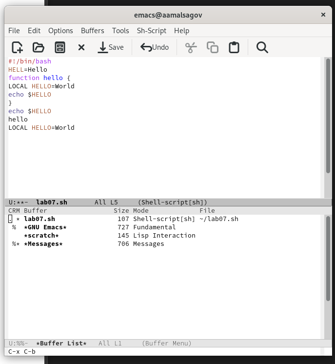{ #fig:009 width=70% }

10. Вывел список активных буферов на экран.(рис. [-@fig:010])

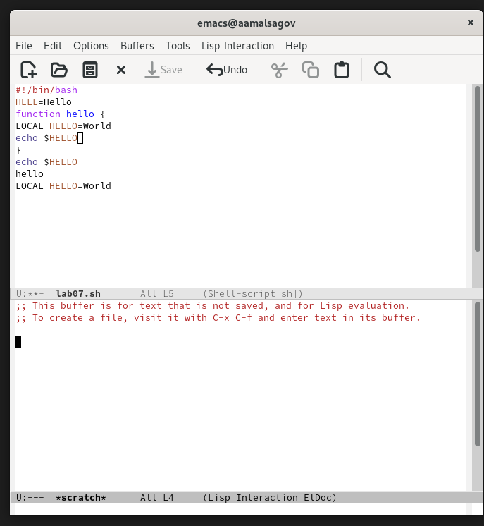{ #fig:010 width=70% }

11. Закрыл это окно.(рис. [-@fig:011])

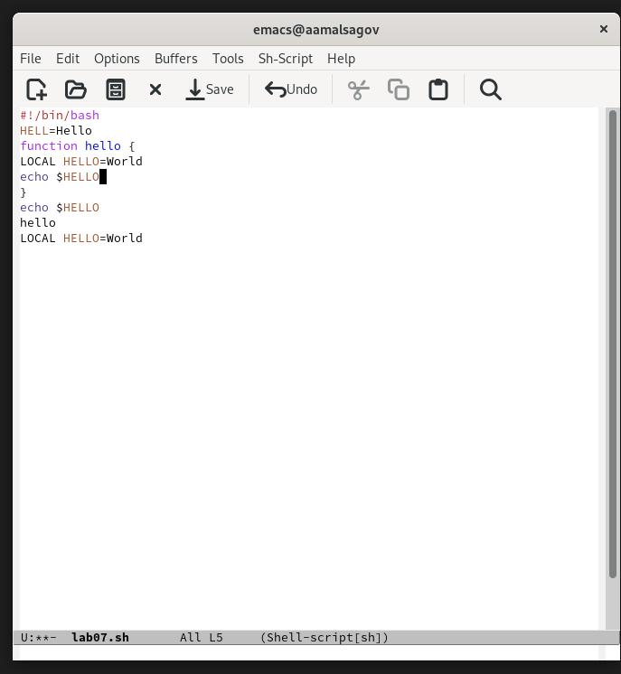{ #fig:011 width=70% }

12. Вновь переключился между буферами, но уже без вывода их списка на экран. (рис. [-@fig:012])

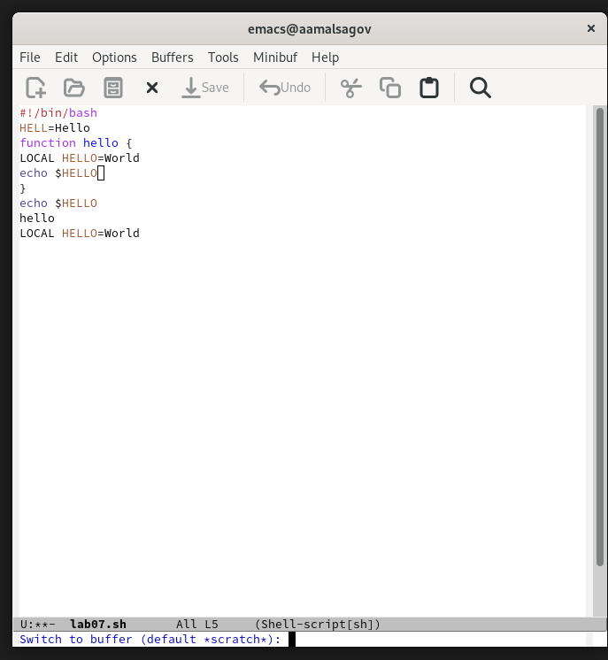{ #fig:012 width=70% }

13. Поделил фрейм на 4 части: разделил фрейм на два окна по вертикали,
а затем каждое из этих окон на две части по горизонтали. В каждом из четырёх созданных окон открыл новый буфер (файл) и ввел несколько строк текста. (рис. [-@fig:013])

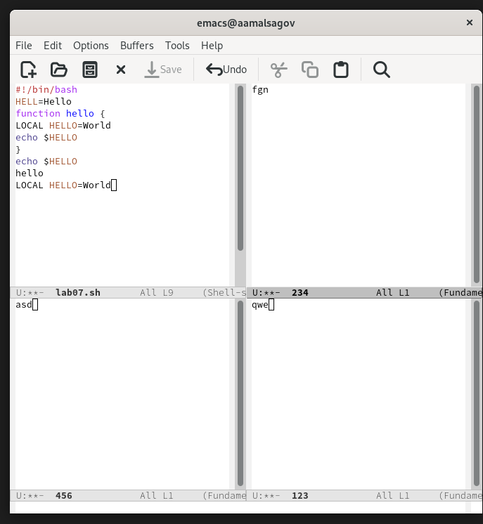{ #fig:013 width=70% }

14. Переключился в режим поиска и нашел слово echo.Переключился между результатами поиска(рис. [-@fig:014])

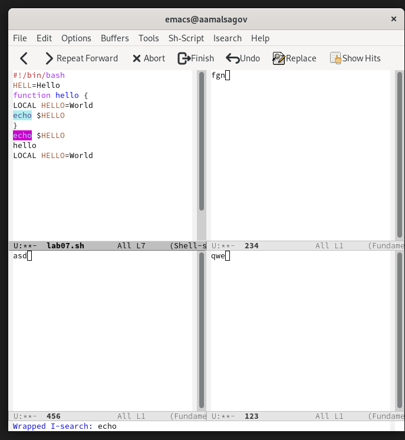{ #fig:014 width=70% }

15. Испробовал другой режим поиска.(рис. [-@fig:015])

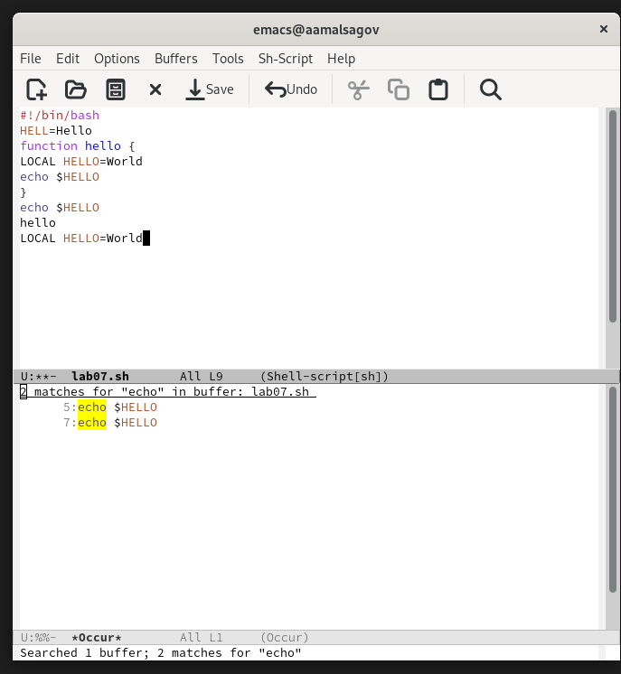{ #fig:015 width=70% }

# Выводы

Мы получили базовые навыки использования emacs.

# Контрольные вопросы

1. Emacs представляет собой мощный экранный редактор текста, написанный на языке
высокого уровня Elisp.

2. Многие рутинные операции в Emacs удобнее производить с помощью клавиатуры, а не
графического меню. Наиболее часто в командах Emacs используются сочетания c клавишами Ctrl и Meta (в обозначениях Emacs: C- и M-; клавиша Shift в Emasc обозначается
как S-). Так как на клавиатуре для IBM PC совместимых ПК клавиши Meta нет, то вместо
неё можно использовать Alt или Esc.

3. Если своими словами, то буфер - это файл, содержащий какой-либо текст. Окно же можно сказать область, где вы водится текст определенного буфера.

4. Можно открыть больше 10 буферов в одном окне.

5. Только что запущенный Emacs несет один буфер с именем `*scratch*', который может быть использован для вычисления выражений Лиспа в Emacs.

6. Ctrl-c |(первые две нажму вместе, а третью отдельно), Ctrl-c Ctrl-|(каждую пару нажму раздельно).

7. Разделить фрейм на два окна по вертикали (C-x 3),а по горизонтали (C-x 2) .

8. В файле Emacs хранятся настройки редактора.

9. Кнопка BACKSPACE = функции C-k и ее можно переназначить.

10. Редактор Emacs мне показался удобнее, так как в нем больше возможностей по сравнению с vi.