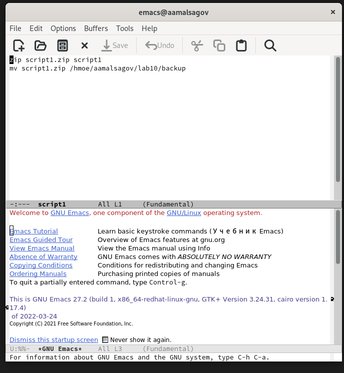
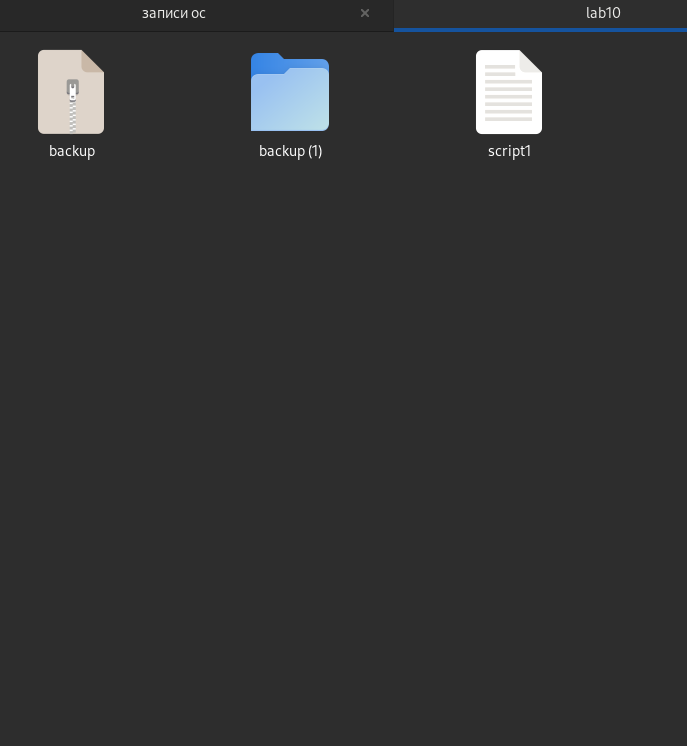
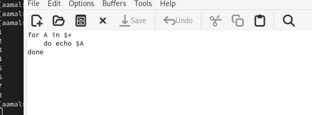
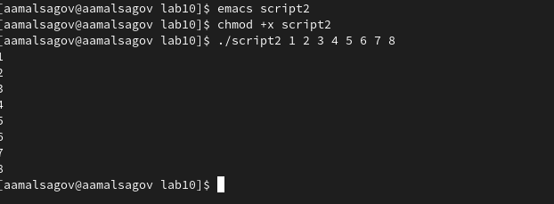
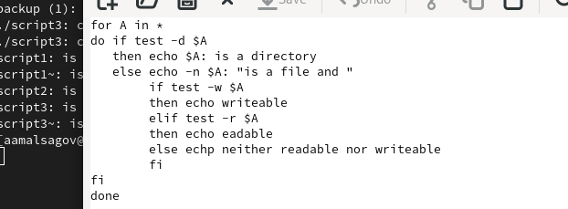
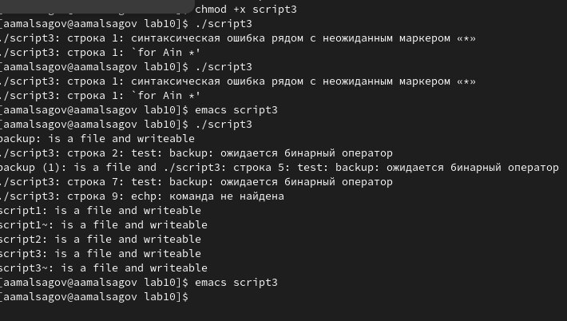
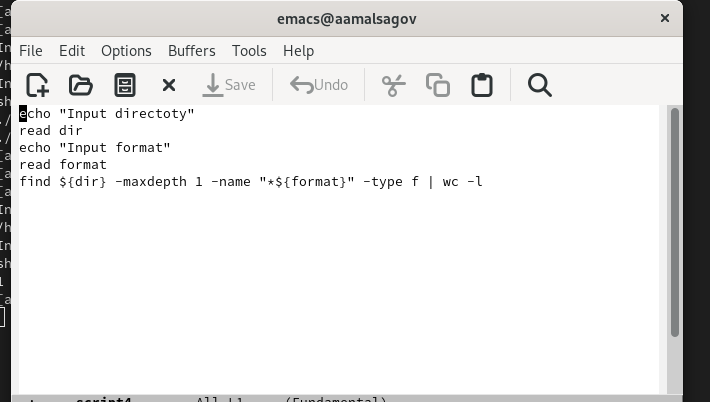
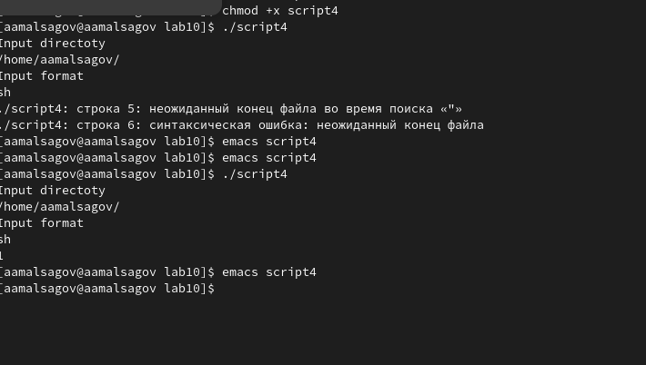

---
## Front matter
lang: ru-RU
title: "Программирование в командном процессоре ОС UNIX. Командные файлы"
author: Мальсагов А.А.
institute:
date: 

## Formatting
toc: false
slide_level: 2
theme: metropolis
header-includes: 
 - \metroset{progressbar=frametitle,sectionpage=progressbar,numbering=fraction}
 - '\makeatletter'
 - '\beamer@ignorenonframefalse'
 - '\makeatother'
aspectratio: 43
section-titles: true
---

## Цель работы

Изучить основы программирования в оболочке ОС UNIX/Linux. Научиться писать небольшие командные файлы.

---

## Выполнение лабораторной работы

1. Создал script1 и открыл его в emacs. Написал программу,которая при запуске будет делать резервную копию самого себя. (рис. [-@fig:001])

{ #fig:001 width=70% }

---

## Выполнение лабораторной работы

2. Проверил его работу. (рис. [-@fig:002])

{ #fig:002 width=70% }

---

## Выполнение лабораторной работы

3. Создал script2 и открыл его в emacs. Написал программу, обрабатывающая любое произвольное число аргументов командной строки(рис. [-@fig:003])

{ #fig:003 width=70% }

---

## Выполнение лабораторной работы

4. Запустил скрипт.(рис. [-@fig:004])

{ #fig:004 width=70% }

---

## Выполнение лабораторной работы

5. Создал script3 и открыл его в emacs. Написал программу, аналог команды ls.(рис. [-@fig:005])

{ #fig:005 width=70% }

---

## Выполнение лабораторной работы

6. Проверил работу скрипта. (рис. [-@fig:006])

{ #fig:006 width=70% }

---

## Выполнение лабораторной работы

7. Создал script4 и открыл его в emacs. Написал программу, которая просит ввести путь к директории и формат файла, а затем выдает количество файлов с данным форматом в данной директориии.(рис. [-@fig:007])

{ #fig:007 width=70% }

---

## Выполнение лабораторной работы

8. Запустил скрипт.(рис. [-@fig:008])

{ #fig:008 width=70% }

---

## Выводы

Мы научились писать небольшие командые файлы.
