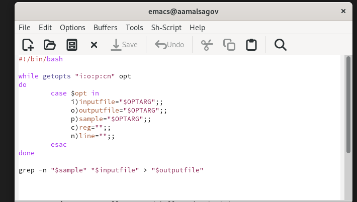
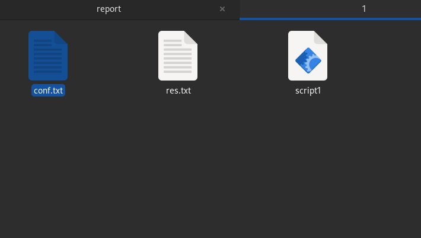
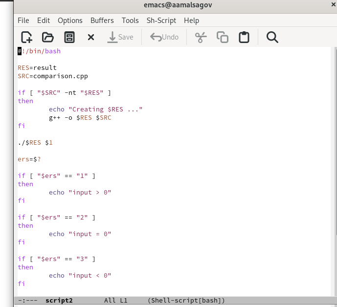
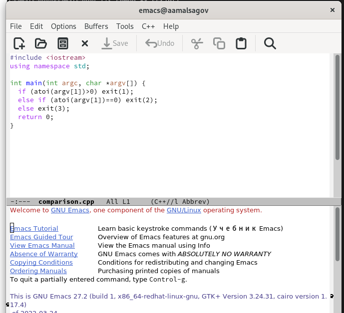
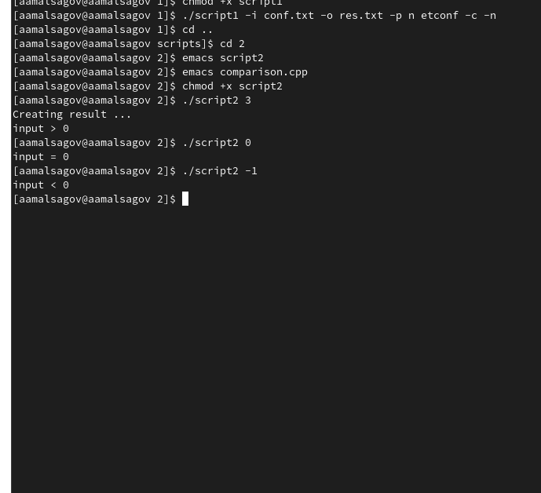
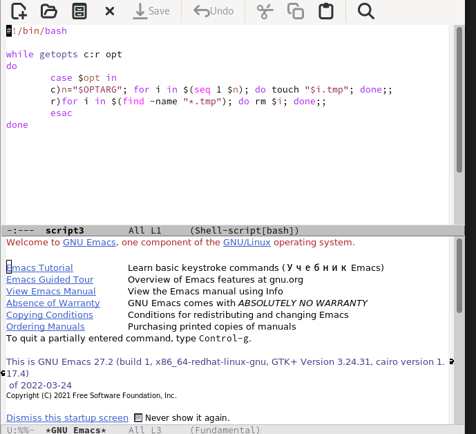
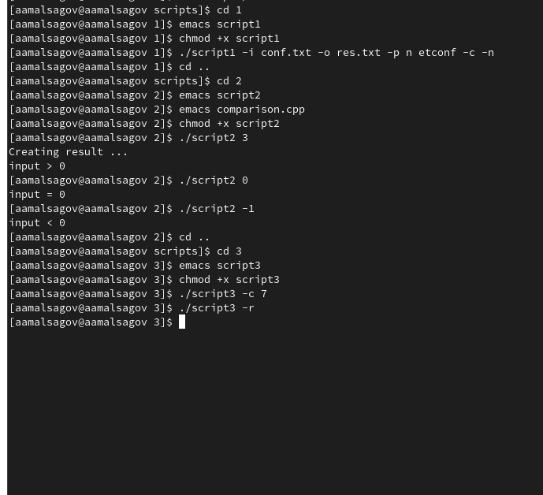
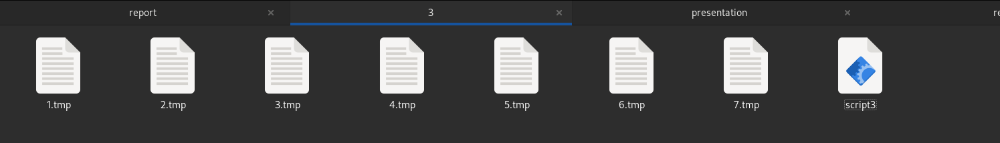
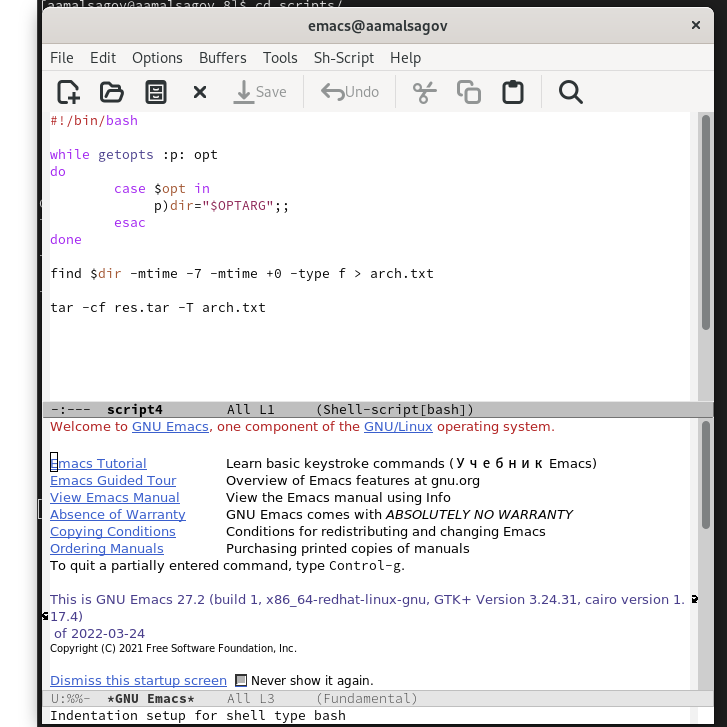
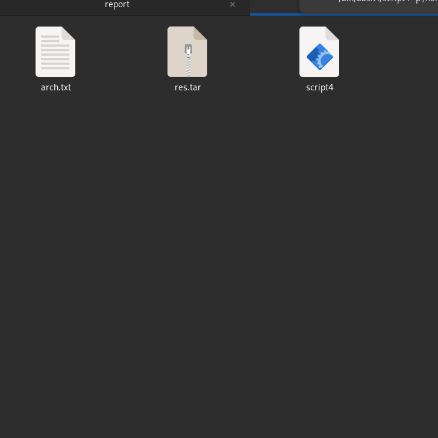

---
## Front matter
lang: ru-RU
title: "Программирование в командномпроцессоре ОС UNIX. Ветвления и циклы"
author: Мальсагов А.А.
institute:
date: 

## Formatting
toc: false
slide_level: 2
theme: metropolis
header-includes: 
 - \metroset{progressbar=frametitle,sectionpage=progressbar,numbering=fraction}
 - '\makeatletter'
 - '\beamer@ignorenonframefalse'
 - '\makeatother'
aspectratio: 43
section-titles: true
---

## Цель работы

Изучить основы программирования в оболочке ОС UNIX. Научится писать более сложные командные файлы с использованием логических управляющих конструкций и циклов.

---

## Выполнение лабораторной работы

1. Создал script1 и открыл его в emacs. Написал программу, которая читает данные из указанного файла, записывает их в другой файл, учитывая введеннные опции. (рис. [-@fig:001])

{ #fig:001 width=70% }

---

## Выполнение лабораторной работы

2. Проверил его работу. (рис. [-@fig:002])

{ #fig:002 width=70% }

---

## Выполнение лабораторной работы

3. Написал командынй файл и программу на языке С++, которые получают на входе число и выводят больше, равно или меньше ли оно **0**. (рис. [-@fig:003;-@fig:004])

{ #fig:003 width=70% }

---

## Выполнение лабораторной работы

{ #fig:004 width=70% }

---

## Выполнение лабораторной работы

4. Запустил скрипт.(рис. [-@fig:005])

{ #fig:005 width=70% }

---

## Выполнение лабораторной работы

5. Создал script3 и открыл его в emacs. Написал программу, которая в зависимости от введенных опций либо создает определенное кол-во файлов, либо удаялет их всех.(рис. [-@fig:006])

{ #fig:006 width=70% }

---

## Выполнение лабораторной работы

6. Проверил работу скрипта. (рис. [-@fig:007;-@fig:008])

{ #fig:007 width=70% }

---

## Выполнение лабораторной работы

{ #fig:008 width=70% }

---

## Выполнение лабораторной работы

7. Создал script4 и открыл его в emacs. Написал программу, которая с помощью команды tar заковывает в архив все файлы в укзанной директории. Модифицировал его так, чтобы запоковывались только те файлы, которые были изменены менее недили тому назад.(рис. [-@fig:009])

{ #fig:009 width=70% }

---

## Выполнение лабораторной работы

8. Запустил скрипт.(рис. [-@fig:010])

{ #fig:010 width=70% }

---

## Выводы

Мы научились писать более сложные командые файлы.
