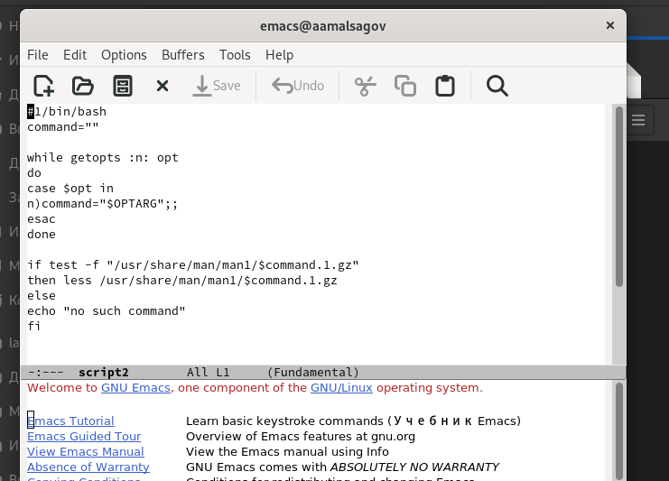

---
## Front matter
lang: ru-RU
title: "Программирование в командном процессоре ОС UNIX. Расширенное программирование"
author: Мальсагов А.А.
institute:
date: 

## Formatting
toc: false
slide_level: 2
theme: metropolis
header-includes: 
 - \metroset{progressbar=frametitle,sectionpage=progressbar,numbering=fraction}
 - '\makeatletter'
 - '\beamer@ignorenonframefalse'
 - '\makeatother'
aspectratio: 43
section-titles: true
---

## Цель работы

Изучить основы программирования в оболочке ОС UNIX. Научиться писать более сложные командные файлы с использованием логических управляющих конструкций и циклов.

---

## Выполнение лабораторной работы

1. Создал script1 и открыл его в emacs. Написал программу, реализующая упрощённый механизм семафоров. Командный файл в течение некоторого времени t1 дожидается освобождения ресурса, выдавая об этом сообщение, а дождавшись его освобождения, использует его в течение некоторого времени t2<>t1, также выдавая информацию о том, что ресурс
используется соответствующим командным файлом.(рис. [-@fig:001])

{ #fig:001 width=70% }

---

## Выполнение лабораторной работы

2. Проверил его работу. (рис. [-@fig:002])

{ #fig:002 width=70% }

---

## Выполнение лабораторной работы

3. Написал командынй файл, который получает в виде аргумента командной строки название команды и в виде результата выдает справку об этой команде или сообщение об отсутствии справки, если  соответствующего файла нет в каталоге man1. (рис. [-@fig:003])

{ #fig:003 width=70% }

---

## Выполнение лабораторной работы

4. Запустил скрипт.(рис. [-@fig:004])

{ #fig:004 width=70% }

---

## Выполнение лабораторной работы

5. Используя встроенную переменную $RANDOM, написал командный файл, генерирующий случайную последовательность букв латинского алфавита.(рис. [-@fig:005])

{ #fig:005 width=70% }

---

## Выполнение лабораторной работы

6. Проверил работу скрипта. (рис. [-@fig:006])

{ #fig:006 width=70% }

---

## Выводы

Мы научились писать более сложные командые файлы.
