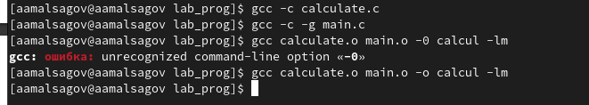
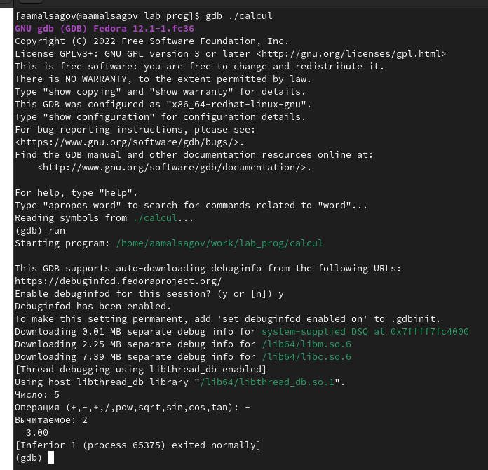
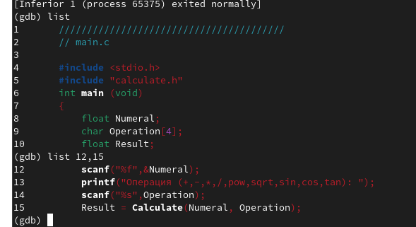
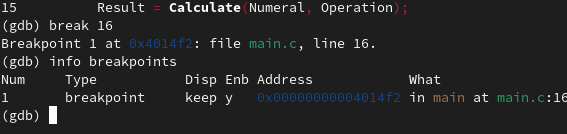
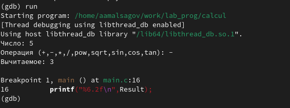
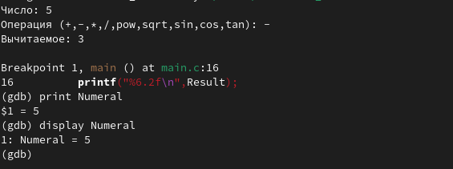
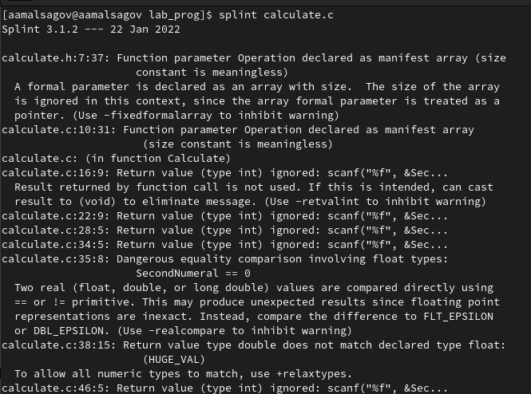

---
## Front matter
lang: ru-RU
title: "Средства, применяемые при разработке программного обеспечения в ОС типа UNIX/Linux"
author: Мальсагов А.А.
institute:
date: 

## Formatting
toc: false
slide_level: 2
theme: metropolis
header-includes: 
 - \metroset{progressbar=frametitle,sectionpage=progressbar,numbering=fraction}
 - '\makeatletter'
 - '\beamer@ignorenonframefalse'
 - '\makeatother'
aspectratio: 43
section-titles: true
---

## Цель работы

Приобрести простейшие навыки разработки, анализа, тестирования и отладки приложений в ОС типа UNIX/Linux на примере создания на языке программирования С калькулятора с простейшими функциями.

---

## Выполнение лабораторной работы

1. Создал каталог work/os/lab_prog. СОздал в нем файлы **calculate.h, calculate.c, main.c, makefile**. Скопировал весь код из лабораторки. Выполнил компиляцию этих файлов.(рис. [-@fig:001])

{ #fig:001 width=70% }

---

## Выполнение лабораторной работы

2. Выполнил отладку.Прверил работу калькулятора (рис. [-@fig:002])

{ #fig:002 width=70% }

---

## Выполнение лабораторной работы

3. Вывел первые 9 строк файла main Затем вывел с 12 по 15 строки. (рис. [-@fig:003])

{ #fig:003 width=70% }

---

## Выполнение лабораторной работы

4. Поставил точку остановы.(рис. [-@fig:004])

{ #fig:004 width=70% }

---

## Выполнение лабораторной работы

5. Снова запустил калькулятор.(рис. [-@fig:005])

{ #fig:005 width=70% }

---

## Выполнение лабораторной работы

6. Вывел значение Numeral. (рис. [-@fig:006])

{ #fig:006 width=70% }

---

## Выполнение лабораторной работы

7. С помощью утилиты splint проанализировал коды файлов calculate.c и main.c. (рис. [-@fig:007])

{ #fig:007 width=70% }

---

## Выводы

Мы создали простейший калькулятор.
