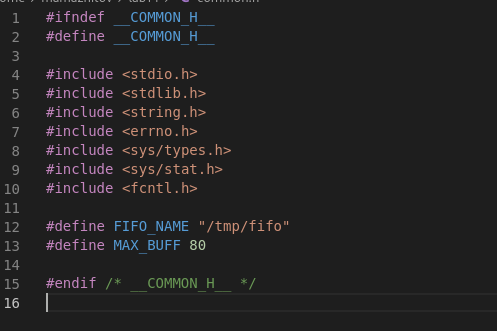
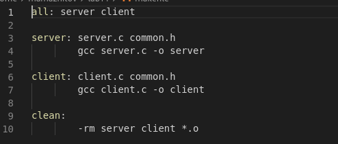

---
## Front matter
lang: ru-RU
title: "Именованные каналы"
author: Мальсагов А.А.
institute:
date: 

## Formatting
toc: false
slide_level: 2
theme: metropolis
header-includes: 
 - \metroset{progressbar=frametitle,sectionpage=progressbar,numbering=fraction}
 - '\makeatletter'
 - '\beamer@ignorenonframefalse'
 - '\makeatother'
aspectratio: 43
section-titles: true
---

## Цель работы

Приобретение практических навыков работы с именованными каналами.

---

## Выполнение лабораторной работы

1. Создал файлы **common.h, server.c, client.c, client2.c**. Скопировал основной код из лабораторки и немного подкорректировал его.(рис. [-@fig:001;-@fig:002;-@fig:003;-@fig:004])

{ #fig:001 width=70% }

---

## Выполнение лабораторной работы

{ #fig:002 width=70% }

---

## Выполнение лабораторной работы

{ #fig:003 width=70% }

---

## Выполнение лабораторной работы

{ #fig:004 width=70% }

---

## Выполнение лабораторной работы

2. Создал **makefile**. (рис. [-@fig:005])

{ #fig:005 width=70% }

---

## Выполнение лабораторной работы

3. Запустил makefile, а затем сервер. (рис. [-@fig:006])

{ #fig:006 width=70% }

---

## Выполнение лабораторной работы

4. Запустил client в отдельном окне терминала.(рис. [-@fig:007])

{ #fig:007 width=70% }

---

## Выводы

Мы научились пользоваться иеннованными каналами.
